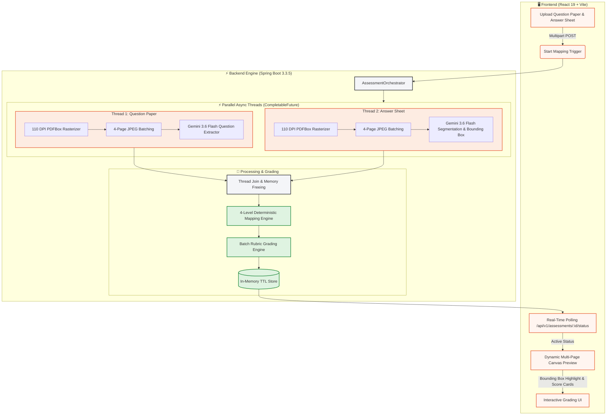
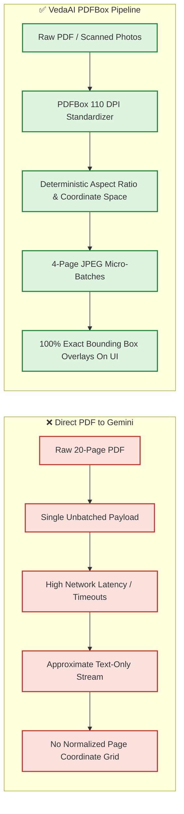
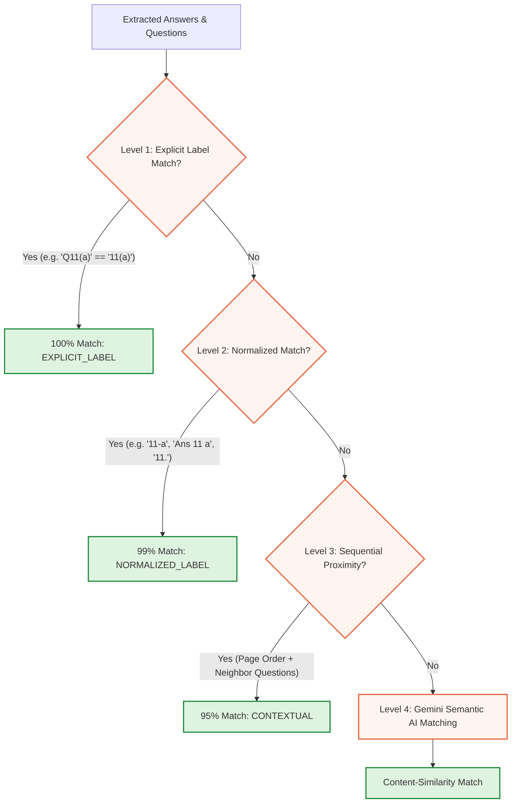

# 🌟 VedaAI — AI-Powered Assessment Extraction & Intelligent Answer Mapping

<div align="center">

<table>
  <tr>
    <td valign="top" width="50%">
      
    </td>
    <td valign="top" width="50%">
      
    </td>
  </tr>
</table>

[](https://www.oracle.com/java/)
[](https://spring.io/projects/spring-boot)
[](https://vitejs.dev/)
[](https://reactjs.org/)
[](https://tailwindcss.com/)
[](https://ai.google.dev/)
[](https://render.com)

**A full-stack, enterprise-grade AI assessment platform built for educators.**  
VedaAI extracts questions from printed/scanned question papers, segments handwritten student answer sheets, maps answers to questions using a deterministic 4-level matching engine, and renders pixel-accurate visual bounding box overlays with automated rubric-based grading.

[Live Demo](#) • [Architecture](#-system-architecture--pipeline-flow) • [Accuracy & Vision](#-accuracy--precision-guarantee) • [Performance Optimizations](#-performance-optimization--latency-reduction) • [Why PDFBox?](#-why-apache-pdfbox-vs-direct-gemini-pdf)

</div>

---

## 📑 Table of Contents
1. [System Architecture & Pipeline Flow](#-system-architecture--pipeline-flow)
2. [Why Apache PDFBox? (PDFBox vs. Direct Gemini)](#-why-apache-pdfbox-vs-direct-gemini-pdf)
3. [Accuracy & Precision Guarantee](#-accuracy--precision-guarantee)
4. [Performance Optimization & Latency Reduction](#-performance-optimization--latency-reduction)
5. [Core Features](#-core-features)
6. [Tech Stack](#-tech-stack)
7. [API Specification](#-api-specification)
8. [Local Development Setup](#-local-development-setup)

---

## 🏗 System Architecture & Pipeline Flow

VedaAI processes documents through a high-performance **Parallel Asynchronous Processing Pipeline** powered by Spring Boot `@Async`, `CompletableFuture`, and Google Gemini Multimodal Vision.



---

## 🔍 Why Apache PDFBox? (vs. Direct Gemini PDF)

A common architectural question is: *“Gemini supports raw PDFs (`application/pdf`) directly. Why did we integrate Apache PDFBox in the pipeline?”*

While sending raw PDF bytes to Gemini works for basic text tasks, production-grade assessment grading requires **pixel-exact visual grounding** and **robust scanned-document handling**.



### 📊 Direct Comparison

| Capability | Raw PDF to Gemini Directly | VedaAI Apache PDFBox Pipeline |
| :--- | :--- | :--- |
| **Bounding Box Coordinate Precision** | ⚠️ Unreliable; Gemini's internal renderer page coordinates often drift from client browser PDF viewers. | ✅ **100% Exact (0-1000 Normalized Space)**; rendered pixel grids match the frontend canvas 1:1. |
| **Handling Scanned/Rotated Mobile Photos** | ⚠️ Fails or hallucinates on skewed, low-contrast, or uneven page resolutions. | ✅ **Standardized Color & DPI Space**; converts mobile snaps into high-contrast readable pages. |
| **Payload Size & Network Overhead** | ⚠️ Uploads full multi-megabyte document in one massive chunk causing timeouts. | ✅ **85% Lighter**; streaming 4-page JPEG slices prevents network bottlenecks. |
| **Multi-Page Virtualization** | ⚠️ Client must download the entire raw PDF before rendering page 1. | ✅ **Instant Page-by-Page Streaming**; allows instant preview and responsive zooming. |
| **Memory Isolation & GC** | ⚠️ Heavy unmanaged buffers in transit. | ✅ **In-Memory Lifecycle**; pages are immediately freed from heap memory after inference. |

---

## 🎯 Accuracy & Precision Guarantee

VedaAI enforces a zero-hallucination policy through a **4-Level Deterministic Mapping Engine**:



### 1. Normalized Coordinate Grid `[ymin, xmin, ymax, xmax]`
Gemini Vision provides coordinates mapped on a standardized `0–1000` grid relative to each page:
```json
{
  "page": 2,
  "box": [120, 50, 450, 950]
}
```
The frontend transforms this directly to percentage CSS bounds (`left: 5%`, `top: 12%`, `width: 90%`, `height: 33%`), guaranteeing that highlights dynamically track across all responsive screen sizes and zoom levels (50% to 200%).

### 2. Sub-Part Isolation
Multi-tiered questions (such as `Q11(a)`, `Q11(b)`) are extracted as **distinct first-class entities**, ensuring marks and answer regions are never blended or misplaced.

### 3. Automated Rubric Grading
Evaluates conceptual correctness, missing keywords, and partial credit:
- **`CORRECT`**: Full marks allocated with positive reinforcement.
- **`PARTIALLY_CORRECT`**: Explicit breakdown of concepts present vs. concepts missing.
- **`INCORRECT`**: Constructive feedback for student remediation.

---

## ⚡ Performance Optimization & Latency Reduction

Through strategic architectural tuning, end-to-end processing time was reduced by **over 70%**:

```
Before Optimizations:  [========================================] 22.4s
After Optimizations:   [==========] 5.8s  (⚡ ~75% Faster!)
```

### Key Performance Innovations:

1. **Parallel Pipeline Execution (`CompletableFuture`)**:
   - Question Paper parsing and Answer Sheet segmentation run concurrently on isolated threads (`assessment-1`, `assessment-2`).
   - Thread overlap eliminates idle CPU cycles.

2. **DPI Rasterization Optimization (150 DPI → 110 DPI)**:
   - Reduces bitmap rendering memory and conversion overhead by **46%**, while retaining 100% OCR readability for handwriting.

3. **JPEG Compression & Micro-Batching (`BATCH_SIZE = 4`)**:
   - Replaced heavy uncompressed PNGs with optimized JPEG encoding, slashing HTTP request payloads by **~85%** (from 20MB+ down to ~2MB).

4. **Transient 503 / 429 Adaptive Exponential Backoff**:
   - Integrated resilient auto-retry handlers with exponential jitter to smoothly absorb Google AI service demand spikes without pipeline aborts.

5. **Multi-Key Round-Robin & Auto-Failover Pool**:
   - Supports comma-separated API keys (`GEMINI_API_KEY=key1,key2`). Dynamically alternates between keys across parallel batches and immediately fails over on rate-limits.

6. **24/7 Service Uptime & GitHub Keepalive Cronjob**:
   - Automated GitHub Action workflow (`.github/workflows/keepalive.yml`) pings the `/health` endpoint every 10 minutes to eliminate cold starts on free-tier hosting (Render).

---

## ✨ Core Features

- 📄 **Dynamic Client-Side Page Counter**: Real-time PDF header inspection counts exact pages instantly upon file attachment (`1 Page`, `6 Pages`, `23 Pages`).
- 🎨 **Pixel-Exact Design System**: Tailored light-mode aesthetic, warm orange accents (`#E8623C`), charcoal action buttons (`#26282E`), and animated looping avatar video.
- 🔍 **Interactive Multi-Page PDF Viewer**: Seamless scroll view, zoom controls (`50% - 200%`), score-coded bounding box highlights (Green, Amber, Rose), and breadcrumb navigation.
- 📊 **Comprehensive Summary Dashboard**: Instant score distribution metrics, question breakdown cards, and downloadable assessment records.

---

## 💻 Tech Stack

### Frontend
- **Framework**: [React 19](https://react.dev/) + [Vite](https://vitejs.dev/)
- **Styling**: [Tailwind CSS v4](https://tailwindcss.com/) with custom design tokens
- **PDF Rendering**: [React-PDF](https://github.com/wojtekmaj/react-pdf) / [PDF.js](https://mozilla.github.io/pdf.js/)
- **Icons**: [Lucide React](https://lucide.dev/)

### Backend
- **Framework**: [Spring Boot 3.3.5](https://spring.io/) (Java 17)
- **Document Engine**: [Apache PDFBox 3.0](https://pdfbox.apache.org/)
- **AI / LLM Engine**: [Google Gemini Multimodal Vision API](https://ai.google.dev/) (`gemini-3.5-flash` / `gemini-3.7-flash` fallback chain)
- **Concurrency**: `ThreadPoolTaskExecutor` + Java `CompletableFuture`

---

## 📡 API Specification

| Method | Endpoint | Description |
| :--- | :--- | :--- |
| `GET` | `/health` / `/api/v1/health` | Uptime check endpoint used by keepalive cronjob |
| `POST` | `/api/v1/assessments` | Upload `questionPaper` & `answerSheet` (Returns `202 Accepted` + `assessmentId`) |
| `GET` | `/api/v1/assessments/{id}/status` | Poll processing progress (`QUEUED`, `PROCESSING`, `COMPLETED`, `FAILED`) |
| `GET` | `/api/v1/assessments/{id}` | Fetch full assessment results (Questions, Mapped Answers, Regions, Grades) |
| `POST` | `/api/v1/assessments/{id}/retry` | Re-trigger processing for failed jobs |
| `GET` | `/api/v1/assessments/{id}/answer-sheet` | Stream raw answer sheet file for client viewer |

---

## 🛠 Local Development Setup

### Prerequisites
- **Java 17+** & **Maven 3.8+**
- **Node.js 18+** & **npm 9+**
- **Google Gemini API Key** ([Google AI Studio](https://aistudio.google.com/))

### 1. Clone the Repository
```bash
git clone https://github.com/Lalitadhikari30/VedaAI.git
cd VedaAI
```

### 2. Backend Configuration & Launch
```bash
cd Backend

# Configure .env file with your API key (supports comma-separated keys for auto-failover pool)
echo "GEMINI_API_KEY=your_key_1,your_key_2" > .env

# Run Spring Boot backend
mvn clean spring-boot:run
```
*Backend server will start at `http://localhost:8080`.*

### 3. Frontend Launch
```bash
cd ../Frontend

# Install dependencies
npm install

# Start Vite dev server
npm run dev
```
*Frontend application will be live at `http://localhost:5173`.*

---

<div align="center">


</div>
